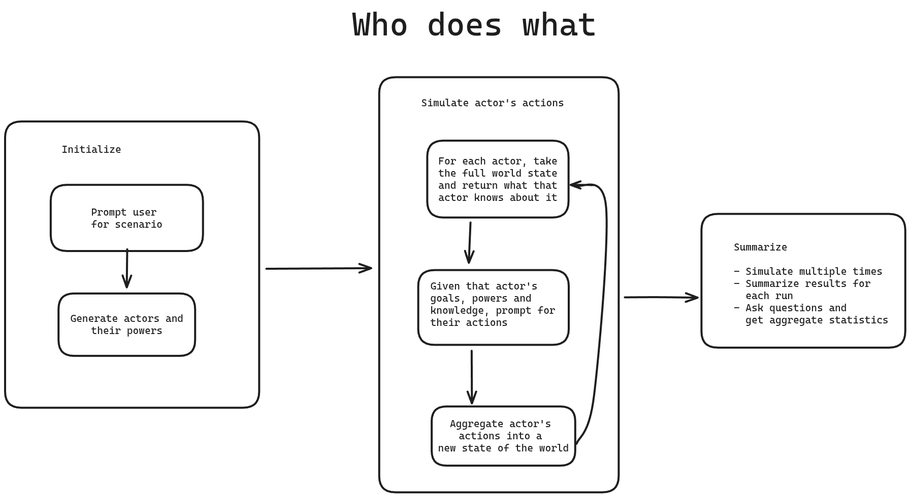

# Who Does What

Given an scenario, create actors with goals and powers, simulate their interactions over multiple turns, and answer questions about the outcomes.

Here is 



Here is an example output, on whether Trump will invoke the Insurrection Act.

```
Simulation 9: false - No. In the provided final world state and full action history, the Trump administration escalates immigration enforcement through a declared southern border emergency; expanded expedited removal; mass removal flights; nationwide Homeland Security Task Forces; a sharp expansion of 287(g) agreements; OBBBA-funded detention/agent/wall buildouts; CBP interior support deployments; and multiple White House/DHS directives that centralize weekly performance targets, field-office scorecards, and rapid resource redeployments. The legal/governance posture described focuses on DHS operational orders, emergency/rapid procurement, interagency task-force operations, and DOJ/OSG litigation to narrow injunctions and seek Supreme Court review. There is no event or action indicating invocation of the Insurrection Act, nor any described domestic deployment under that statute; the domestic surges (e.g., the Minneapolis deployment of ~3,000 agents) are framed as DHS/ICE/CBP and partner-agency operations, not Insurrection Act authorities.
```

## Installation

```bash
go build -o who-does-what
```

## Built with

- Golang
- Claude Code
- OpenAI API

## Usage

```
./who-does-what                                  # Run with default scenario
./who-does-what --interactive                    # Interactive mode with single-line input
./who-does-what --interactive --multiline        # Interactive mode, specify scenario in more depth
./who-does-what --num-simulations 10             # Run multiple simulations
./who-does-what --num-simulations 10 --multiline # Run multiple simulations, specify scenario in more depth
```

This tool works better if the initial scenario is well specified and has accurate and up-to-date info, e.g., from perplexity.

### Default Mode (Single Simulation)

Run a single simulation with the default scenario: whether the Bank of Japan will change rates such that the Japan carry trade unwinds.

```bash
./who-does-what
```

### Interactive Mode

Run an interactive session where you can:
- Define your own scenario
- Edit actor files before simulation
- Review and edit each turn's data
- Save all data to a session folder

```bash
./who-does-what --interactive
```

The interactive mode will:

1. Ask for a scenario description (single line by default)
2. Ask for the number of turns
3. Ask for a summarization question (single line by default)
4. Create a `session_<pid>` directory
5. Generate actors and save them to `actors/` directory
6. Allow you to edit actor files
7. Run each turn and save data to `turn_N/` directories
8. Save the final result to `final_result.json`

### Multiple Simulations Mode

Run multiple simulations to get aggregate statistics:

```bash
./who-does-what --num-simulations 10
```

This will:
1. Prompt for scenario description (single line, or multiline with `--multiline` flag), number of turns, and question
2. Create a `multi_sim_<timestamp>` directory
3. Run N independent simulations **in parallel** with the same scenario
4. Save each simulation to `simulation_N/` subdirectory with:
   - `actors.json` - Generated actors
   - `turn_N/actions.json` - Actions from each turn
   - `turn_N/world_state.json` - World state after each turn
   - `result.json` - Final result with yes/no answer
   - `simulation.log` - Full detailed log of the simulation
5. Save aggregate results to `aggregate_results.json`
6. Display aggregate statistics (percentage of yes/no outcomes)
7. Display one-paragraph summaries of each simulation result

Directory structure:
```
multi_sim_<timestamp>/
├── scenario.json              # Scenario, question, and turns
├── simulation_1/
│   ├── actors.json
│   ├── turn_1/
│   │   ├── actions.json
│   │   └── world_state.json
│   ├── turn_2/
│   │   └── ...
│   ├── result.json
│   └── simulation.log
├── simulation_2/
│   └── ...
└── aggregate_results.json
```

**Note:** In this mode, you cannot edit actors or actions between runs. This mode is designed for statistical analysis, not interactive editing.

**Parallelism:** Simulations run in parallel, significantly reducing total runtime. For example, 10 simulations run in roughly the time it takes to complete the slowest simulation, rather than 10x the time of a single simulation.

**Logging:** Each simulation writes its detailed output (actors, world state, actions) to its own `simulation.log` file. This allows parallel execution without log interleaving. Progress updates ("Starting simulation N", "Completed simulation N") are shown on the console.

**Output:** After all simulations complete, aggregate statistics and one-paragraph summaries of each simulation are displayed.

### Multiline Input Mode

Enable multiline input for scenarios and questions:

```bash
./who-does-what --interactive --multiline
./who-does-what --num-simulations 10 --multiline
```

By default, input is single-line (press Enter to submit). With the `--multiline` flag:
- You can enter multiple lines for scenario descriptions and questions
- Type `END` on a new line by itself to finish your input
- Useful for complex, multi-paragraph scenarios

Example with `--multiline`:
```
Enter the scenario description (enter 'END' on a new line when done):
The European Central Bank is considering whether to raise interest rates.
Key factors include inflation, unemployment, and economic growth.
There are competing pressures from different member states.
END

Enter number of turns to simulate: 3

Enter the question to answer at the end (enter 'END' on a new line when done):
Will the ECB raise interest rates by at least 0.5%?
END
```

### Verbose Mode

Enable detailed logging for debugging:

```bash
./who-does-what --verbose
./who-does-what --num-simulations 10 --verbose
./who-does-what --interactive --verbose
```

The `--verbose` flag enables detailed logging of:
- HTTP requests to OpenAI API
- Schema generation
- JSON marshalling/unmarshalling
- Internal function calls

By default, verbose logging is disabled and only meaningful output (actor actions, world state, results) is shown.

## Important Notes

**The `--interactive` and `--num-simulations` flags cannot be used together.** They represent different workflows:
- `--interactive`: Single simulation with full file editing capabilities
- `--num-simulations`: Multiple automated simulations for statistical analysis

Using both flags will result in an error.

## Architecture

The simulation follows these steps:

1. **Generate Actors**: Create actors with names, goals, and powers based on the scenario
2. **Initialize World State**: Create an initial state with events and description
3. **Simulate Turns**: For each turn:
   - Each actor observes their filtered view of the world (based on what they would know)
   - Each actor decides on an action based on their view
   - All actions are applied to update the world state
4. **Answer Question**: Analyze the final state to answer a yes/no question about the outcome

## Key Features

- **Information Asymmetry**: Actors only see what they would realistically know
- **Parallel Processing**:
  - Actor decisions within each turn are processed in parallel
  - Multiple simulations run in parallel for faster statistical analysis
- **LLM-Driven**: All major decisions powered by OpenAI's API
- **Robust API Calls**: Automatic retry with exponential backoff (up to 5 attempts) for failed requests
- **Interactive Editing**: Review and modify actors and turn data in real-time
- **Statistical Analysis**: Run multiple simulations to understand outcome distributions
- **Comprehensive Logging**: Each simulation gets its own detailed log file

## Examples

### Running with default scenario
```bash
./who-does-what
```

### Interactive session
```bash
./who-does-what --interactive
# Follow the prompts to define your scenario
# Edit actor files and review turn data

# For complex multi-paragraph scenarios, use --multiline flag
./who-does-what --interactive --multiline
```

### Statistical analysis
```bash
./who-does-what --num-simulations 100
# Enter your scenario, turns, and question when prompted
# Get percentage breakdown of outcomes across 100 automated simulations
# View one-paragraph summaries of each simulation result
```

Example output:
```
=== AGGREGATE RESULTS ===
Question: Did the Bank of Japan raise rates?
Total simulations: 10
Yes count: 7
No count: 3
Yes percentage: 70.0%

Results saved to: multi_sim_20260203_143022

=== INDIVIDUAL SIMULATION SUMMARIES ===

Simulation 1: Yes - The Bank of Japan raised interest rates by 0.25% after careful consideration of domestic economic stability and international pressures...
Simulation 2: No - The Bank of Japan maintained its current policy stance, citing concerns about economic recovery and the potential impact on the carry trade...
...
```

### Verbose logging for debugging
```bash
./who-does-what --verbose
./who-does-what --num-simulations 10 --verbose
# See detailed HTTP requests, schema generation, and internal operations
```

### Combining flags
```bash
# Interactive mode with multiline input and verbose logging
./who-does-what --interactive --multiline --verbose

# Multiple simulations with multiline input
./who-does-what --num-simulations 50 --multiline
```

## Configuration

Set your OpenAI API key in a `.env` file:

```
OPENAI_API_KEY=your_api_key_here
```
